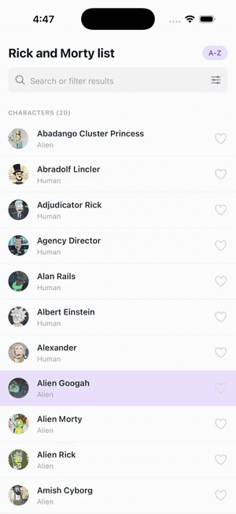
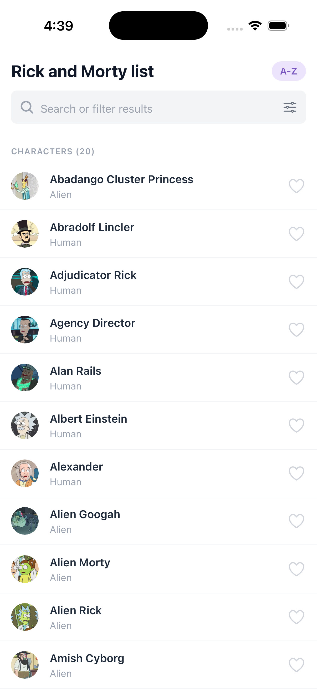
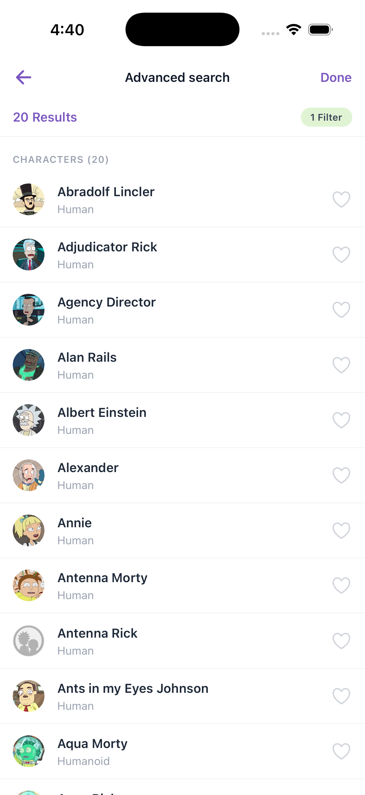
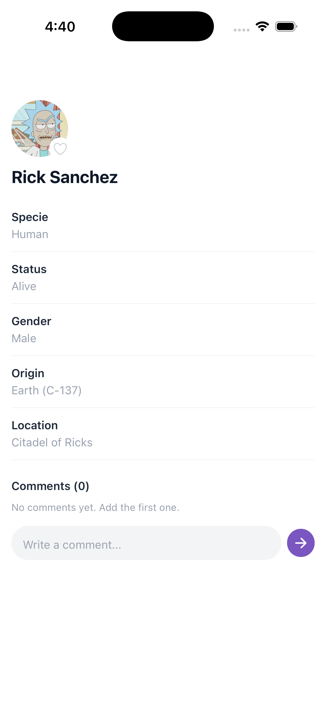
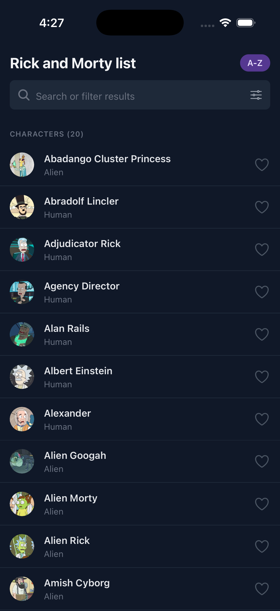
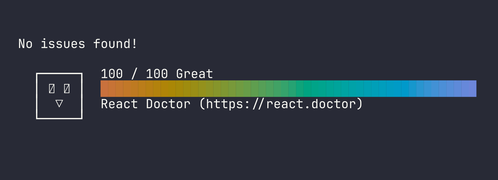
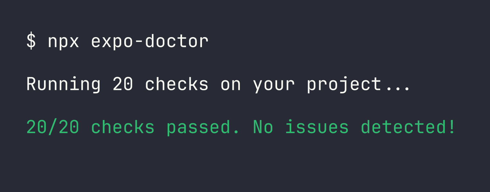

# Rick and Morty

A React Native app for browsing and searching Rick and Morty characters, built
with Expo SDK 57 and the [Rick and Morty GraphQL API](https://rickandmortyapi.com/documentation/#graphql).

> **Reviewing this submission?** The one-page
> [**tech lead brief**](CTO-BRIEF.md) has the targets, the evidence, and the
> decisions behind the code.

## Demo

<p align="center">
  
</p>

> 🎬 Prefer video? [Watch the MP4](docs/media/demo.mp4)

## Screenshots

| Home | Filters | Advanced search | Detail | Dark mode |
|:---:|:---:|:---:|:---:|:---:|
|  |  |  |  |  |

## Features

- Character list with name, image and species, paginated as you scroll
- Sort by name, A-Z or Z-A
- Search by name, plus filters for species, status, gender, and starred characters
- Advanced search screen showing the filtered results and the active filter count
- Character detail with image, specie, status, gender, origin and location
- Favorites, pinned in their own section at the top of the list
- Comments on any character, kept across app restarts
- Soft delete: long press a row to hide a character, restore it any time from the banner

## Tech stack

| What | With |
| --- | --- |
| Framework | React Native 0.86, Expo SDK 57 |
| Language | TypeScript, strict mode |
| Data | Apollo Client 4 over the public GraphQL API |
| Navigation | React Navigation 7, native stack |
| Styles | Tailwind via NativeWind 5 |
| State | Zustand 5, persisted to AsyncStorage |
| Images | expo-image, with caching |
| Tests | Jest, jest-expo, React Native Testing Library |

## Running it

You need Node 20+ and, for the iOS simulator, Xcode (or Android Studio for Android).

```bash
npm install
npx expo start
```

Then press `i` for the iOS simulator, `a` for Android, or scan the QR code with
[Expo Go](https://expo.dev/go) on a phone.

## Tests

```bash
npm test          # run the suite
npm run test:watch
npm run typecheck # tsc --noEmit
```

Thirty tests cover the sort comparator, the filter helpers, the stores,
row interactions, and both list screens rendered against a mocked GraphQL query.

## How the API is used

All data comes from `https://rickandmortyapi.com/graphql` through two queries in
`src/services/queries.ts`:

- `characters(page, filter)` — the paginated list. The name search and the
  species, status and gender filters are passed as `FilterCharacter` arguments,
  so the API does the matching.
- `character(id)` — one character for the detail screen.

Pagination merges through a type policy in `src/services/apollo.ts`: pages are
appended and deduplicated by id, so a repeated request can never produce
duplicate rows.

Favorites, comments, the soft delete and the starred/others filter are
client-side concerns the API has no concept of. They live in Zustand stores
persisted to AsyncStorage.

## Project structure

```
src/
├── components/   # visual components, grouped by feature (see its README)
│   ├── character/
│   ├── common/
│   ├── detail/
│   ├── filters/
│   └── search/
├── screens/      # Home, AdvancedSearch, CharacterDetail
├── services/     # Apollo client and GraphQL queries
├── store/        # favorites, comments, deleted, applied filters
├── hooks/        # useCharacters: fetch + section building, shared by both lists
├── interfaces/   # domain shapes and component props
├── types/        # union types and navigation params
└── utils/        # sorting and filter helpers, unit tested
```

The design follows the Figma mockup: the palette (primary purples, secondary
green) is defined as Tailwind theme tokens in `global.css`.

## Code health

The full codebase scores **100/100** on [React Doctor](https://react.doctor)
(security, performance, correctness and architecture scan), and
**expo-doctor** passes all 20 project checks.





Reproduce both:

```bash
npx react-doctor@latest .
npx expo-doctor
```
